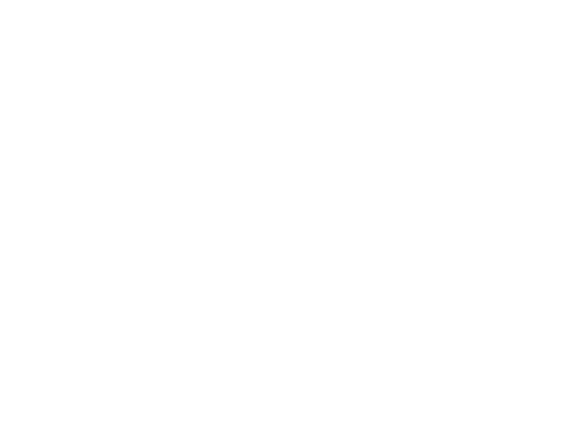

# What Really Drives Developer Salaries?

## Introduction

Understanding what influences developer salaries is an important question for both job seekers and employers. In this project, I analyzed data from the StackOverflow Developer Survey to explore the key factors that affect salary and to build a prediction model.

## 1. What features influence salary the most?

The most important feature analyzed was **years of experience**. However, the data shows that experience alone does not strongly determine salary. While salaries tend to increase slightly with experience, the relationship is not very strong.

The scatterplot below illustrates this relationship.

## 2. Are there any surprising patterns in the data?
One surprising insight is the **large variation in salaries across all experience levels**. 
Developers with the same number of years of experience can earn very different salaries. This suggests that other factors, such as location, skills, or company, play a significant role.

## 3. How accurate is the model?
A linear regression model was trained to predict salary based on experience, education and work experience. The model achieved an **R2 score of approximately 0.15**.

This means the model explains only about **15% of salary variation**, indicating that many important factors are missing from the dataset.

## 4. What happens in a predictive scenario?
To demonstrate the model, a sample prediction was made.
For a developer with a given level of experience, the model predicts a specific salary value. While the prediction provides a reasonable estimate, it also highlights the model's limitations due to missing variables.

## Conclusion
This project shows that developer salaries are influenced by more than just experience. While experience has some impact, salary varies significantly due to many external factors.
The analysis highlights the importance of using multiple variables when building predictive models and demonstrates how data science can uncover real-world insights even from imperfect data.
